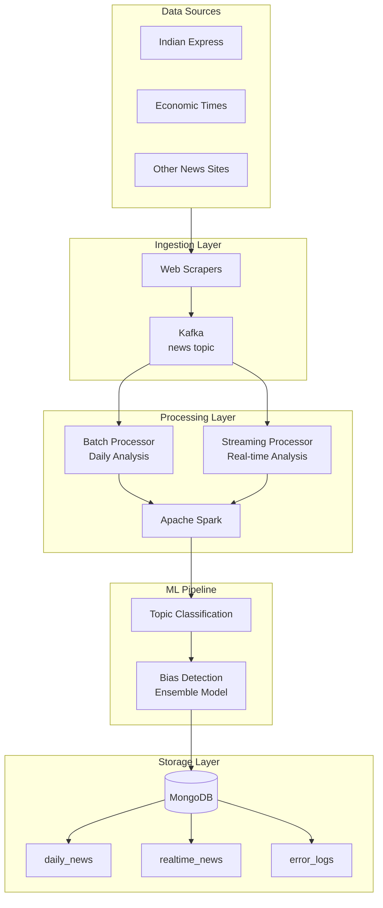
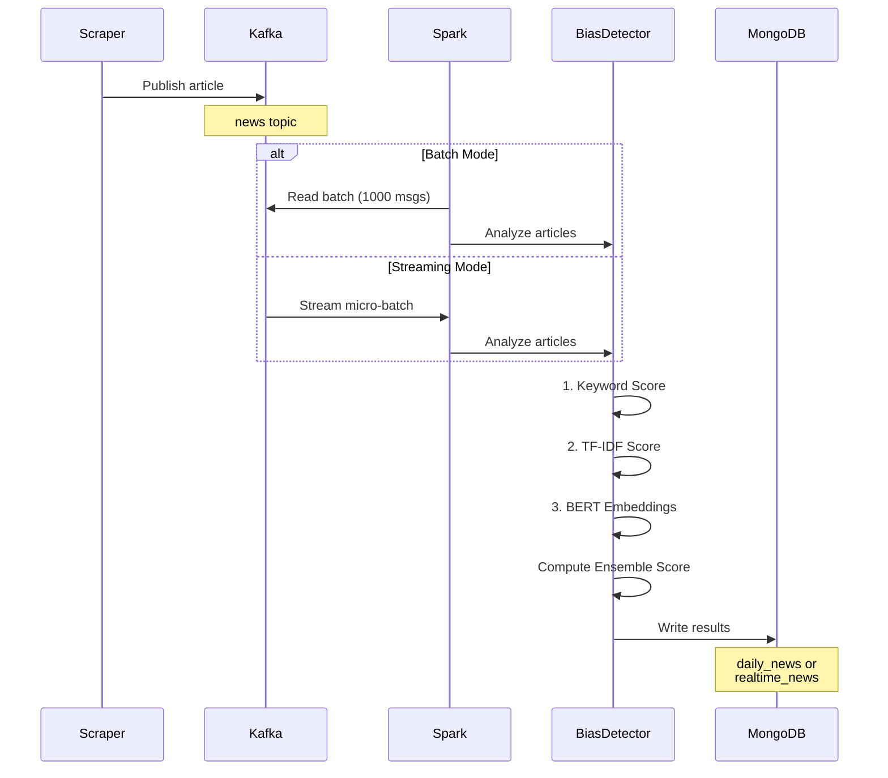

# Bias Detection in News Media

A scalable system for detecting multi-dimensional bias in Indian news articles using ensemble machine learning methods with Apache Spark, Kafka, and MongoDB.

## Overview

This project analyzes news articles from Indian media sources (Indian Express, Economic Times) to detect bias across multiple dimensions:

- **Political** (left/right/centrist)
- **Gender** (male/female stereotypes)
- **Religious** (multi-faith bias)
- **Caste** (upper/lower caste focus)
- **Regional** (geographic bias)
- **Socioeconomic** (wealth/poverty focus)

### Ensemble Detection Method

Combines three complementary approaches for robust bias detection:

1. **Keyword Matching (30%)** - Fast, interpretable baseline
2. **TF-IDF Analysis (30%)** - Term importance weighting
3. **BERT Embeddings (40%)** - Semantic context understanding using `all-MiniLM-L6-v2`

## Architecture

### System Design



### Data Flow Sequence



## Project Structure

```
bias-detection-in-news-media/
├── config/                    # Configuration
│   └── config.py             # Kafka, MongoDB, Spark, Bias configs
├── src/
│   ├── scrapers/             # Web scraping modules
│   │   ├── scrape_indian_express.py
│   │   ├── scrape_article_content.py
│   │   └── scraping_news.py
│   ├── processing/           # Data processing
│   │   ├── batch/
│   │   │   └── batch_processor.py
│   │   └── streaming/
│   │       ├── streaming_processor.py
│   │       └── kafka_producer.py
│   ├── models/               # ML models
│   │   ├── bias_detection.py
│   │   ├── catogorise_the_article.py
│   │   └── spark_bias_detector.py
│   └── utils/
│       └── error_handler.py
├── scripts/                  # Utility scripts
│   ├── run_pipeline.sh
│   └── setup_kafka_topics.py
├── notebooks/                # Jupyter notebooks for experiments
├── data/
│   ├── raw/                  # Raw CSV data
│   └── processed/            # Processed data
└── docker-compose.yml        # Infrastructure setup
```

## Quick Start

### Prerequisites

- Python 3.8+
- Docker & Docker Compose
- 8GB RAM (recommended)

**Windows Users:**
- Install [Docker Desktop for Windows](https://docs.docker.com/desktop/install/windows-install/)
- Use PowerShell or Command Prompt (examples for both provided below)
- *Optional*: Install [WSL2](https://learn.microsoft.com/en-us/windows/wsl/install) for a Linux-like experience

### 1. Install Dependencies

#### macOS/Linux

```bash
# Install Python dependencies
pip install -r requirements.txt

# Make scripts executable (if needed)
chmod +x scripts/run_pipeline.sh
```

#### Windows

```powershell
# Install Python dependencies
pip install -r requirements.txt

# Note: Shell scripts (.sh) don't run natively on Windows
# Use the Python commands directly (shown below) or use WSL/Git Bash
```

### 2. Start Infrastructure

#### macOS/Linux

```bash
# Start Kafka, Zookeeper, MongoDB
docker-compose up -d

# Wait 30 seconds for services to initialize
sleep 30

# Create Kafka topics
python scripts/setup_kafka_topics.py

# OR use the convenience script
./scripts/run_pipeline.sh setup
```

#### Windows (PowerShell)

```powershell
# Start Kafka, Zookeeper, MongoDB
docker-compose up -d

# Wait 30 seconds for services to initialize
Start-Sleep -Seconds 30

# Create Kafka topics
python scripts/setup_kafka_topics.py
```

#### Windows (Command Prompt)

```cmd
:: Start Kafka, Zookeeper, MongoDB
docker-compose up -d

:: Wait 30 seconds for services to initialize
timeout /t 30

:: Create Kafka topics
python scripts\setup_kafka_topics.py
```

### 3. Verify Setup

- **Kafka UI**: http://localhost:8080
- **Mongo Express**: http://localhost:8081 (admin/admin)

### 4. Run the System

#### Option A: Batch Processing (Daily Analysis)

**macOS/Linux:**
```bash
# 1. Publish articles to Kafka
PYTHONPATH=. python src/processing/streaming/kafka_producer.py \
    --csv data/raw/economic_times_articles_2024.csv \
    --batch-size 100

# OR use the script (recommended)
./scripts/run_pipeline.sh producer --csv data/raw/economic_times_articles_2024.csv --batch-size 100

# 2. Process batch
PYTHONPATH=. python src/processing/batch/batch_processor.py

# OR use the script (recommended)
./scripts/run_pipeline.sh batch

# 3. Check results
mongosh mongodb://localhost:27018/bias_detection
> db.daily_news.find().limit(5)
```

**Windows (PowerShell):**
```powershell
# 1. Publish articles to Kafka
$env:PYTHONPATH = "."
python src/processing/streaming/kafka_producer.py --csv data/raw/economic_times_articles_2024.csv --batch-size 100

# 2. Process batch
python src/processing/batch/batch_processor.py

# 3. Check results
mongosh mongodb://localhost:27018/bias_detection
# > db.daily_news.find().limit(5)
```

**Windows (Command Prompt):**
```cmd
:: 1. Publish articles to Kafka
set PYTHONPATH=.
python src\processing\streaming\kafka_producer.py --csv data\raw\economic_times_articles_2024.csv --batch-size 100

:: 2. Process batch
python src\processing\batch\batch_processor.py

:: 3. Check results
mongosh mongodb://localhost:27018/bias_detection
```

#### Option B: Streaming Processing (Real-time)

**macOS/Linux:**
```bash
# Terminal 1: Start streaming processor
PYTHONPATH=. python src/processing/streaming/streaming_processor.py --console
# OR use the script (recommended)
./scripts/run_pipeline.sh stream --console

# Terminal 2: Simulate real-time news
PYTHONPATH=. python src/processing/streaming/kafka_producer.py \
    --csv data/raw/economic_times_articles_2024.csv \
    --realtime \
    --delay 0.5
# OR use the script (recommended)
./scripts/run_pipeline.sh producer --csv data/raw/economic_times_articles_2024.csv --realtime --delay 0.5

# Terminal 3: Monitor (optional)
PYTHONPATH=. python src/utils/error_handler.py --retry
# OR use the script (recommended)
./scripts/run_pipeline.sh error --retry
```

**Windows (PowerShell):**
```powershell
# Terminal 1: Start streaming processor
$env:PYTHONPATH = "."
python src/processing/streaming/streaming_processor.py --console

# Terminal 2: Simulate real-time news
$env:PYTHONPATH = "."
python src/processing/streaming/kafka_producer.py --csv data/raw/economic_times_articles_2024.csv --realtime --delay 0.5

# Terminal 3: Monitor (optional)
$env:PYTHONPATH = "."
python src/utils/error_handler.py --retry
```

**Windows (Command Prompt):**
```cmd
:: Terminal 1: Start streaming processor
set PYTHONPATH=.
python src\processing\streaming\streaming_processor.py --console

:: Terminal 2: Simulate real-time news
set PYTHONPATH=.
python src\processing\streaming\kafka_producer.py --csv data\raw\economic_times_articles_2024.csv --realtime --delay 0.5

:: Terminal 3: Monitor (optional)
set PYTHONPATH=.
python src\utils\error_handler.py --retry
```

### 5. Query Results

```bash
mongosh mongodb://localhost:27018/bias_detection

# Find high-bias articles
db.realtime_news.find({ overall_bias_score: { $gt: 0.4 } }).limit(10)

# Analyze political distribution
db.realtime_news.aggregate([
    { $group: { _id: "$political_type", count: { $sum: 1 } } }
])
```

## Example Output

**Bias Detection Result:**
```json
{
  "_id": "article_123",
  "title": "Government announces new policy",
  "url": "https://...",
  "overall_bias_score": 0.342,
  "political_bias_score": 0.456,
  "political_type": "right",
  "gender_bias_score": 0.123,
  "religious_bias_score": 0.089,
  "caste_bias_score": 0.234,
  "regional_bias_score": 0.178,
  "socioeconomic_bias_score": 0.267,
  "timestamp": "2024-11-23T10:30:00Z"
}
```

## Configuration

Edit `config/config.py` to customize:

```python
# Kafka settings
kafka_config.bootstrap_servers = "localhost:9092"
kafka_config.news_topic = "news"

# MongoDB settings
mongo_config.uri = "mongodb://localhost:27018/"
mongo_config.database = "bias_detection"

# Bias detection weights
bias_config.keyword_weight = 0.3
bias_config.tfidf_weight = 0.3
bias_config.embedding_weight = 0.4
```

### Adding New Bias Dimensions

1. Update bias keywords in `src/models/bias_detection.py`
2. Add dimension weights in `config/config.py`
3. Update output schema in processors

## Troubleshooting

**Services not starting?**
```bash
# Clean restart
docker-compose down -v
docker-compose up -d

# Check service status
docker-compose ps

# View service logs
docker-compose logs kafka
docker-compose logs mongodb
```

**Port conflicts?**  
Edit `docker-compose.yml` to change ports:
- Kafka: 9092
- MongoDB: 27018
- Kafka UI: 8080
- Mongo Express: 8081

**Import errors?**  
Ensure you're running from project root:

*macOS/Linux:*
```bash
# Check current directory
pwd

# Add to PYTHONPATH
export PYTHONPATH="${PYTHONPATH}:${PWD}"

# Or run as module
python -m src.processing.batch.batch_processor
```

*Windows (PowerShell):*
```powershell
# Check current directory
Get-Location

# Add to PYTHONPATH
$env:PYTHONPATH = "."

# Or run as module
python -m src.processing.batch.batch_processor
```

*Windows (Command Prompt):*
```cmd
:: Check current directory
cd

:: Add to PYTHONPATH
set PYTHONPATH=.

:: Or run as module
python -m src.processing.batch.batch_processor
```

**Kafka connection errors?**  
Wait 30 seconds after starting Docker for Kafka initialization:

*macOS/Linux:*
```bash
docker-compose up -d
sleep 30
python scripts/setup_kafka_topics.py
```

*Windows (PowerShell):*
```powershell
docker-compose up -d
Start-Sleep -Seconds 30
python scripts/setup_kafka_topics.py
```

*Windows (Command Prompt):*
```cmd
docker-compose up -d
timeout /t 30
python scripts\setup_kafka_topics.py
```

**Module not found errors?**

*macOS/Linux:*
```bash
# Verify structure
ls -la src/
ls -la config/

# Check Python path
python -c "import sys; print('\n'.join(sys.path))"
```

*Windows (PowerShell):*
```powershell
# Verify structure
Get-ChildItem src/
Get-ChildItem config/

# Check Python path
python -c "import sys; print('\n'.join(sys.path))"
```

*Windows (Command Prompt):*
```cmd
:: Verify structure
dir src\
dir config\

:: Check Python path
python -c "import sys; print('\n'.join(sys.path))"
```

## Monitoring

- **Spark UI**: http://localhost:4040 (when jobs running)
- **Kafka UI**: http://localhost:8080
- **Mongo Express**: http://localhost:8081 (admin/admin)

View logs:

*macOS/Linux:*
```bash
# Streaming processor logs
tail -f logs/streaming.log

# Error handler logs
tail -f logs/error_handler.log

# Docker service logs
docker-compose logs -f kafka
docker-compose logs -f mongodb
```

*Windows (PowerShell):*
```powershell
# Streaming processor logs
Get-Content logs/streaming.log -Wait

# Error handler logs
Get-Content logs/error_handler.log -Wait

# Docker service logs
docker-compose logs -f kafka
docker-compose logs -f mongodb
```

*Windows (Command Prompt):*
```cmd
:: View log file (static, not tailing)
type logs\streaming.log

:: Docker service logs (works same as Unix)
docker-compose logs -f kafka
docker-compose logs -f mongodb
```

## Stopping the System

*macOS/Linux:*
```bash
# Stop all services
docker-compose down
# OR use the script
./scripts/run_pipeline.sh stop

# Stop and remove volumes (clears all data)
docker-compose down -v
```

*Windows (PowerShell/Command Prompt):*
```powershell
# Stop all services
docker-compose down

# Stop and remove volumes (clears all data)
docker-compose down -v
```

## Tech Stack

- **Processing**: Apache Spark 3.5
- **Messaging**: Apache Kafka
- **Database**: MongoDB
- **ML Models**: 
  - Sentence-Transformers (BERT)
  - Scikit-learn (TF-IDF)
  - Custom ensemble methods
- **Languages**: Python 3.8+

## Future Enhancements

- Add more Indian news sources
- Deploy to AWS (EMR + MSK + DynamoDB)
- Implement web dashboard for visualization
- Add real-time alerting for high-bias content
- Expand to regional language support
