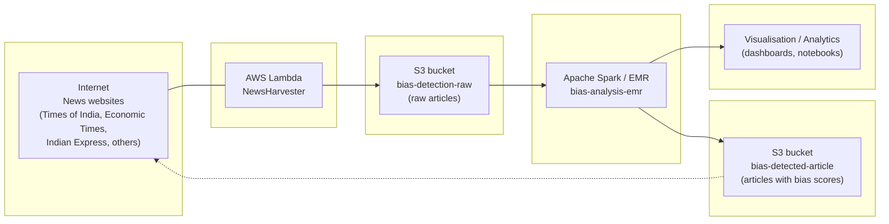

# bias-detection-in-news-media

This repository explores **bias detection in news media at scale**, from scraping raw news articles to topic classification and ensemble bias detection using transformer models.

## Comprehensive Bias Detection System for News Articles

Combines topic classification with multi-dimensional bias analysis.

### Ensemble approach for improved bias detection

This module uses a sophisticated ensemble approach combining three complementary methods:

1. **Keyword Weighted Score (30%)**

    - Simple and interpretable keyword matching
    - Counts occurrences of curated bias-specific keywords
    - Normalized by text length and keyword list size
    - Fast and efficient for quick baseline assessment

2. **TF-IDF Weighted Score (30%)**

    - Uses Term Frequency-Inverse Document Frequency
    - Weighs keywords by their importance in the document
    - Calculates cosine similarity between article and keyword groups
    - Efficient for batch processing and handles term importance

3. **BERT Embedding Similarity (40%)**
    - Uses sentence-transformers (all-MiniLM-L6-v2 model)
    - Captures semantic context and meaning beyond exact keyword matches
    - Computes cosine similarity between article and ideological embeddings
    - Most powerful but computationally intensive

### Advantages

-   **Robustness**: Combines multiple signals reduces false positives/negatives
-   **Context-Aware**: BERT embeddings capture semantic meaning
-   **Interpretability**: Keyword scores provide transparency
-   **Efficiency**: TF-IDF balances speed with sophistication
-   **Adaptability**: Ensemble weights can be adjusted per use case

### Bias detection dimensions

-   Political (left/right/centrist)
-   Gender (male/female bias with stereotype detection)
-   Religious (multi-faith with stereotype detection)
-   Caste (upper/lower caste focus)
-   Regional (geographic bias detection)
-   Socioeconomic (wealth/poverty focus)

Each dimension uses the ensemble approach to produce more accurate bias scores.

## Modules

### `scrape_indian_express.py`

**Role**  
Builds CSV(s) describing articles to scrape from Indian Express and Economic Times (and similar sites in the future). These CSVs are the input for downstream scraping jobs.

**Pending work**

-   Identify and add more Indian news websites similar to Indian Express and Economic Times.
-   Extend the CSV-building logic to incorporate these new sources.
-   Prepare the CSV generation so it can scale to many sources (e.g., scheduled/automated jobs).

### `scrape_article_content.py`

**Role**  
Pulls full article content from URLs or other sources listed in the CSVs.

**Pending work**

-   Implement **parallelism** to speed up content extraction (e.g., multiprocessing / async IO).
-   Adapt the scraping logic for **distributed processing using Apache Spark**.
-   Prepare deployment / integration with **AWS Lambda** for serverless, scalable scraping.

### `categorise_the_article.py`

**Role**  
Categorises article content using topic and classification methods.

**Planned / pending integration from `catogorise_the_article.ipynb`**

-   Implement `create_ensemble_topic_classifier` which incorporates:
    -   `LDA` topic modeling.
    -   `keyword_based_topic_classification`.
    -   `use_pretrained_topic_models`.
    -   `tfidf_clustering_topics`.

**Pending work**

-   Move the notebook (`catogorise_the_article.ipynb`) logic into the production module `catogorise_the_article.py`.
-   Ensure smooth integration and testing of all classification methods (unit tests / sample runs).
-   Scale the classification module using **Apache Spark** and **AWS Lambda**.

### `test_model.py`

**Role**  
Bias detection experimentation using BERT-based and related transformer models.

**Models used / considered**

-   `j-hartmann/emotion-english-distilroberta-base` – emotion detection (proxy for bias).
-   `cardiffnlp/twitter-roberta-base-sentiment-latest` – sentiment (currently used) with labels: negative, neutral, positive.
-   `facebook/bart-large-mnli` – zero-shot classification for custom bias labels.
-   `unitary/toxic-bert` – toxicity / bias: biased vs neutral.
-   `distilbert-base-uncased-finetuned-sst-2-english` – additional sentiment analysis.

**Pending work**

-   Extend the current setup (which only uses `cardiffnlp/twitter-roberta-base-sentiment-latest`).
-   Build an **ensemble bias detector** combining outputs from all the above models to improve robustness.
-   Finalise experiments and evaluate ensemble bias detection performance.
-   Integrate the ensemble bias detection into scalable **Spark** and **AWS Lambda** workflows.

## Cross-cutting / overall pending work

-   **Extend news data sources** beyond Indian Express and Economic Times.
-   Add **parallelism** and adapt workloads for **distributed execution with Apache Spark**.
-   Migrate / deploy scraping, classification, and bias detection components on **AWS Lambda** (and/or EMR) for serverless, event-driven scaling.
-   Convert notebook-based classification code into robust production `.py` modules.
-   Develop, evaluate, and integrate the **bias detection ensemble** into the end-to-end pipeline.
-   Test and validate the entire pipeline once re-architected for scale and robustness.

## Summary table

| Module                      | Pending tasks                                                                                                     |
| --------------------------- | ----------------------------------------------------------------------------------------------------------------- |
| `scrape_indian_express.py`  | Find more news websites; extend CSV building for new sources; prepare for scalable multi-source scraping.         |
| `scrape_article_content.py` | Add parallelism; distribute scraping using Spark; prepare/deploy scalable scraping with AWS Lambda.               |
| `catogorise_the_article.py` | Incorporate ensemble topic classification from notebook; integrate all methods; scale using Spark and Lambda.     |
| `test_model.py`             | Build ensemble from multiple BERT-based models; finalise bias detection experiments; integrate with Spark/Lambda. |
| **Overall**                 | Extend sources; add parallelism; migrate to Spark/Lambda; productionise classification and bias detection.        |

## Architecture (Mermaid diagram)

